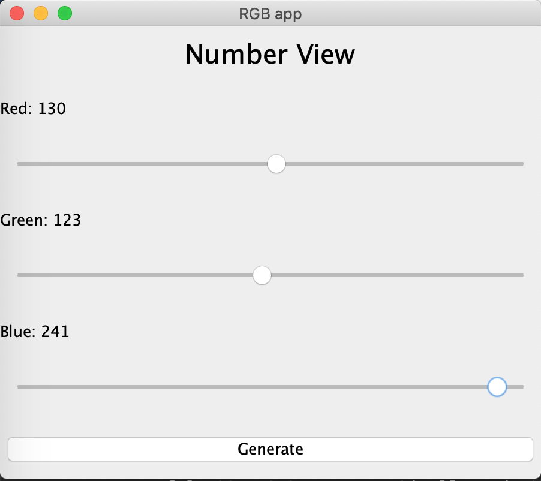

### ashwinchalaka-cs151-hw3
link to repo: [https://github.com/ashwinchalaka/ashwinchalaka-cs151-hw3](https://github.com/ashwinchalaka/ashwinchalaka-cs151-hw3)

##Instructions for the grader
1. See Exercise 1 in the package labeled as "com.ashwinchalaka.hw3.exercise1"
	* Run main in the "TestExercise1.java" file
	* Note: This program randomly generates new test strings (20 random strings in an array) and new test ints (20 random integers in an array).
2. See Exercise 2 in the package labeled as "com.ashwinchalaka.hw3.exercise2"
	* Run main in the "TestExercise2.java" file
	* Note: I used the GUI form rather than the way taught in lecture. So I ran into one problem, the bars in the chart would not resize. Rather than using shapes I had to use "JPanels" and there was no successful attempt to programatically code the heights of the bars in the chart. Instead I adjusted the values and the colors of the bars based on the RGB values selected by the user. Please reference the "rgbApp.java" file --> at the bottom in the "updateGraphViewData()" function.

## Screenshots
###Exercise 1

######Actual Output

###Exercise 2

######Intended Output

######Actual Output

